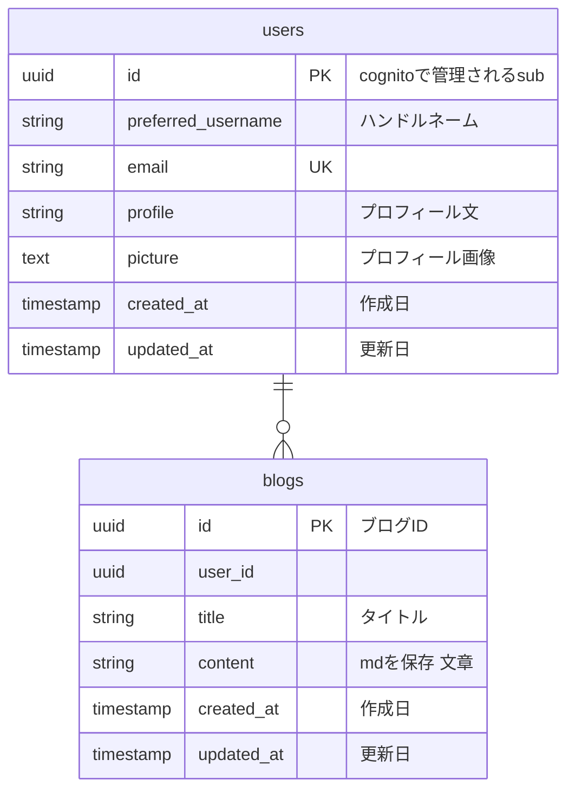

```mermaid
erDiagram
    users {
        uuid id PK "cognitoで管理されるsub"
        string preferred_username "ハンドルネーム"
        string email UK
        string profile "プロフィール文"
        text picture "プロフィール画像"
        timestamp created_at "作成日"
        timestamp updated_at "更新日"
    }
    blogs {
        uuid id PK "ブログID"
        uuid user_id
        string title "タイトル"
        string content "mdを保存 文章"
        timestamp created_at "作成日"
        timestamp updated_at "更新日"
    }

    users 1--0+ blogs : ""
```
