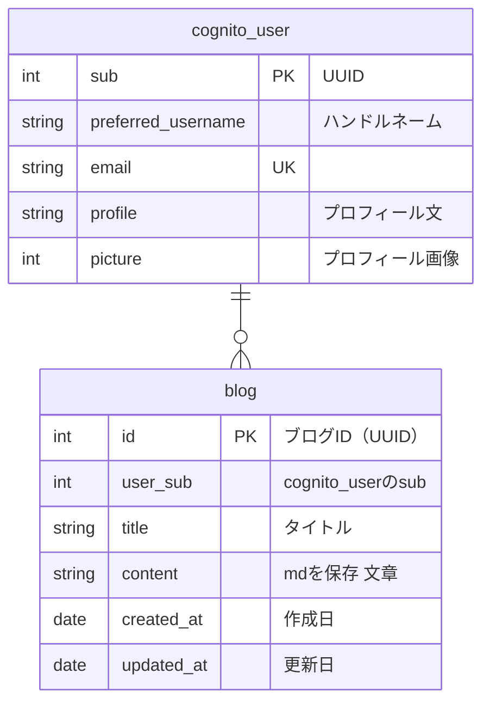

```mermaid
erDiagram
    cognito_user {
        int sub PK "UUID"
        string preferred_username "ハンドルネーム"
        string email UK
        string profile "プロフィール文"
        int picture "プロフィール画像"
    }
    blog {
        int id PK "ブログID（UUID）"
        int user_sub "cognito_userのsub"
        string title "タイトル"
        string content "mdを保存 文章"
        date created_at "作成日"
        date updated_at "更新日"
    }

    cognito_user 1--0+ blog : ""
```
