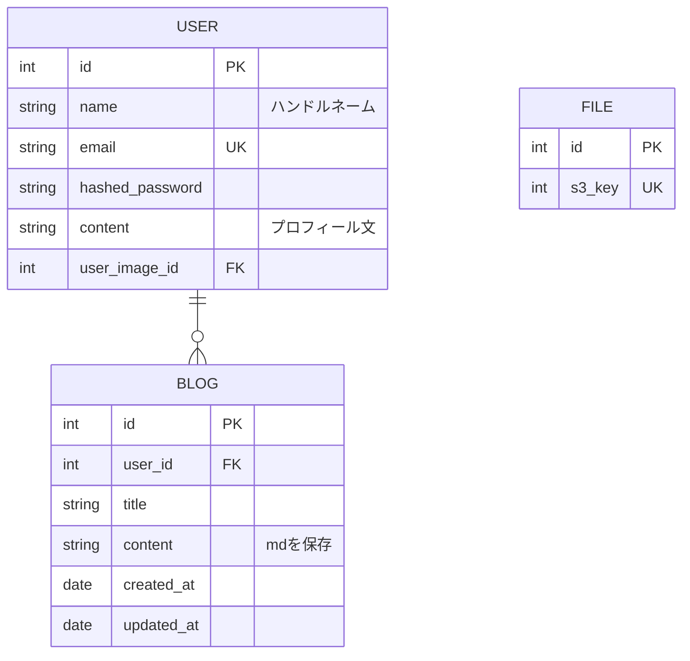

```mermaid
erDiagram
    USER {
        int id PK
        string name  "ハンドルネーム"
        string email UK
        string hashed_password
        string content "プロフィール文"
        int user_image_id FK
    }
    BLOG {
        int id PK
        int user_id FK
        string title
        string content "mdを保存"
        date created_at
        date updated_at
    }
    FILE {
        int id PK
        int s3_key UK
    }

    USER 1--0+ BLOG : ""
```
